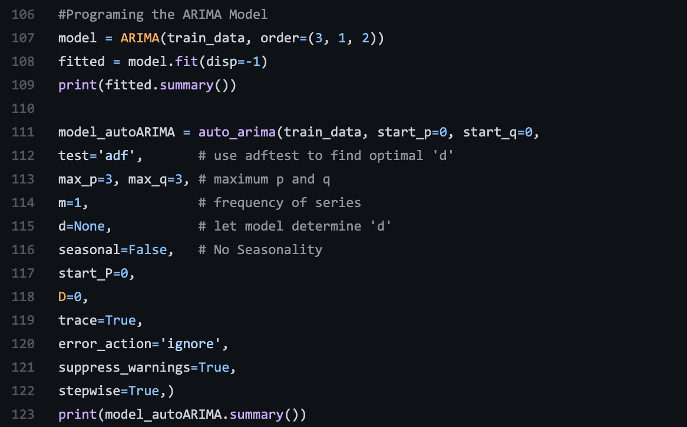

#ARIMA Modeling
What is ARIMA Model? 

ARIMA stands for Autoregressive Integrated Moving Average Model. It is a model that explains a given time series based on its own past values.  

It is a forecasting algorithm that predicts that future value of a stock based on past values of said stock.  

 

ARIMA Models can be broken down into three order parameters: (p,d,q), 

AR(p) Autoregression- regression model that utilizes the relationship between a current observation and past observations. Refers to the number of lags of Y to be used as predictors. 

I(d) Integration- locates if a trend exists, if so than is non stationary and shows seasonality. This reduces seasonality from a time series.  

MA(q) Moving Average- analyzes how wrong in predicting values for past time-periods and make better estimate for the current time-period.  

 

How do you setup an ARMIA model? 

Import packages: These are all the packages that I used for my whole code; some may not be used now but will be utilized is my other posts. 
#	1a. Load libraries 
# 1b. Pull Data using Pandas_Datareader 
  
```{r, echo = FALSE, fig.align = 'center', out.width ='60%'}

```  

#2. Create and Program the ARIMA Model : I used the autoARIMA package. 
```{r, echo = FALSE, fig.align = 'center', out.width ='60%'}

```  
 
```{r, echo = FALSE, fig.align = 'center', out.width ='60%'}

```  
```{r, echo = FALSE, fig.align = 'center', out.width ='60%'}

```  


#3. Use the ARIMA model to forecast the stock 
```{r, echo = FALSE, fig.align = 'center', out.width ='60%'}

```  
#4. Performance check 
```{r, echo = FALSE, fig.align = 'center', out.width ='60%'}

```  
 