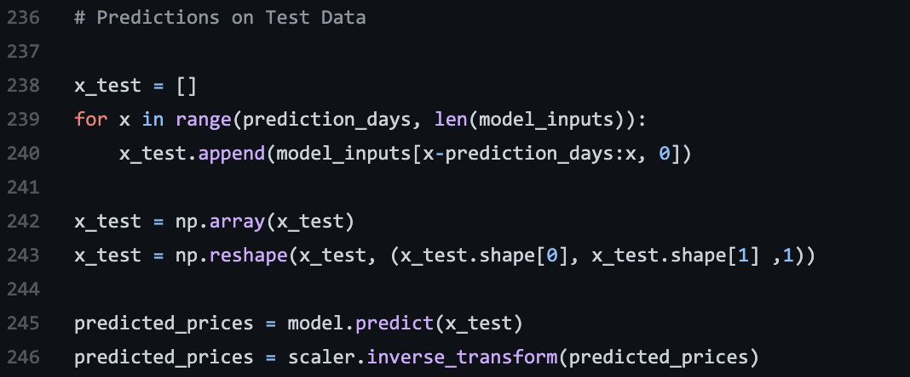

```{r setup, include=FALSE}
knitr::opts_chunk$set(echo = TRUE)
```

# LSTM Modeling

Long Short-Term Memory or LSTM is special kind of RNN (Recurrent neural network), that is capable of learning long-term dependencies. RNN are link memory loops, they keep repeating over and over to give a new point. The problem with them is the more you repeat the loop the more unstable the points of data will be and create long-term dependency problems. That is where LSTM comes into play. LSTM is designed to avoid the long-term dependency problem because unlike RNN the loop or chain doesn’t have one single neural network layer (like RNNs), but four. In the illustration below we will review over why this makes such a difference. 

```{r, echo = FALSE, fig.align = 'center', out.width ='60%'}

```  
```{r, echo = FALSE, fig.align = 'center', out.width ='60%'}

```   

The gates shown above learn which data in a sequence is important and decided to keep or throw away. It will pass the relevant information down the sequences to make the predictions. Therefore, condensing data and removing the outlier that would over populate and cause issues in the predictions.  

# How to setup LSTM? 

1.Import libraries 

2.Pull and process data 

3.Create LSTM Model 

4.Train the data 

5.Predictions 

# 1. Import libraries 
```{r, echo = FALSE, fig.align = 'center', out.width ='60%'}

```  

# 2. Pull and process data 
```{r, echo = FALSE, fig.align = 'center', out.width ='60%'}
knitr::include_graphics("LSTM-3.png")
```  

# Normalize data; I set my prediction days to 60 days to understand how stock prices will look 	over the course of them next 2 months.  

 
# 2b. Prepare the data
```{r, echo = FALSE, fig.align = 'center', out.width ='60%'}

```  
# 3. Build the LSTM Model
```{r, echo = FALSE, fig.align = 'center', out.width ='60%'}

```  
# 4. Train the data
```{r, echo = FALSE, fig.align = 'center', out.width ='60%'}
knitr::include_graphics("LSTM-6.png")
```  
# 5. Predictions

```{r, echo = FALSE, fig.align = 'center', out.width ='60%'}

```  

```{r, echo = FALSE, fig.align = 'center', out.width ='60%'}

```  
```{r, echo = FALSE, fig.align = 'center', out.width ='60%'}
knitr::include_graphics("LSTM-9.png")
```  

 

 
 