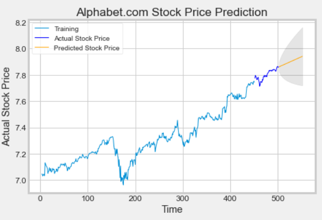

```{r setup, include=FALSE}
knitr::opts_chunk$set(echo = FALSE)
```

# ARIMA Modeling
What is ARIMA Model? 

ARIMA stands for Autoregressive Integrated Moving Average Model. It is a model that explains a given time series based on its own past values.  

It is a forecasting algorithm that predicts that future value of a stock based on past values of said stock.  


# ARIMA Parameters
ARIMA Models can be broken down into three order parameters: (p,d,q), 

AR(p) Autoregression- regression model that utilizes the relationship between a current observation and past observations. Refers to the number of lags of Y to be used as predictors. 

I(d) Integration- locates if a trend exists, if so than is non stationary and shows seasonality. This reduces seasonality from a time series.  

MA(q) Moving Average- analyzes how wrong in predicting values for past time-periods and make better estimate for the current time-period.  


## How do you setup an ARMIA model? 

Import packages: These are all the packages that I used for my whole code; some may not be used now but will be utilized is my other posts. 

##	1a. Load libraries 
```{python, echo=TRUE}
import numpy as np
import matplotlib.pyplot as plt
import pandas as pd
import pandas_datareader as web
from pandas_datareader import data as pdr
import seaborn as sns
import os
import math
from datetime import datetime
import yfinance as yf

from statsmodels.tsa.arima.model import ARIMA
from pmdarima.arima import auto_arima
from sklearn.preprocessing import MinMaxScaler
from sklearn.metrics import mean_squared_error, mean_absolute_error
from tensorflow.keras import Model
from tensorflow.keras import layers
from tensorflow.keras.layers import Dense,Dropout,LSTM
from tensorflow.keras.callbacks import ModelCheckpoint, EarlyStopping

plt.rcParams.update({'font.size': 10})
plt.style.use("fivethirtyeight")
sns.set_style('whitegrid')
```


## 1b. Pull Data using Pandas_Datareader
```{python, echo=TRUE}
company = 'GOOG'
name = 'Alphabet.com'
data = pd.read_csv('GOOG-2.csv')
```


## 2. Create and Program the ARIMA Model : I used the autoARIMA package.

### Split data into train and training set
```{python, echo=TRUE}
df_log = np.log(data['Close'])
plt.rcParams.update({'font.size': 10})
train_data, test_data = df_log[3:int(len(df_log)*0.9)], df_log[int(len(df_log)*0.9):]

plt.figure(figsize=(8,4))
plt.grid(True)
plt.title(f'Closing Test and Train Data for {name}', fontsize= 14)
plt.xlabel('Dates', fontsize=12)
plt.ylabel('Closing Prices', fontsize=12)
plt.plot(df_log, 'green', label='Train data', linewidth=1.5)
plt.plot(test_data, 'blue', label='Test data', linewidth=1.5)
plt.xticks(size = 10)
plt.yticks(size = 10)
plt.legend()
plt.tight_layout()
plt.show()
```

### Programming the ARIMA Model
I am going to use the Auto_Arima for deciding the optimal order for the ARIMA model and the output
gives what fitted ARIMA model as a return. After we recieve the optimal parameters, the next move is run a residual plot from the auto ARIMA. The output for this request will give Standardized residual, histogram plus estimated density, Normal Q-Q, and Correlogram visualizations. 

```{python, echo=TRUE}
model_autoARIMA = auto_arima(train_data, start_p=0, start_q=0,
test='adf',       # use adftest to find optimal 'd'
max_p=3, max_q=3, # maximum p and q
m=1,              # frequency of series
d=None,           # let model determine 'd'
seasonal=False,   # No Seasonality
start_P=0, 
D=0, 
trace=True,
error_action='ignore',  
suppress_warnings=True, 
stepwise=True,)
print(model_autoARIMA.summary())
```

```{python, echo=TRUE}
model = ARIMA(train_data, order=(1, 1, 0))
fitted = model.fit()
print(fitted.summary())
```

```{python, echo=TRUE}
plt.figure()
model_autoARIMA.plot_diagnostics()
plt.subplots_adjust(top=1.4,bottom=1.25)
plt.tight_layout()
plt.show()
```

## 3. Use the ARIMA model to forecast the stock 

### Forecast 

```{r, echo = FALSE, fig.align = 'center', out.width ='100%'}
knitr::include_graphics("forecast.png")
```  
```{r, echo = FALSE, fig.align = 'center', out.width ='100%'}

```  


