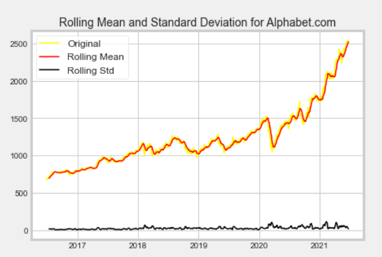

```{r setup, include=FALSE}
knitr::opts_chunk$set(echo = FALSE)
```

In this post we will be looking at data from the stock market. We will be using the python package Pandas’ API, Datareader, to get stock information. Using this data, we will create multiple visuals to investigate different aspects and look at a couple of ways to analyze the risk of said stocks, based on previous performance history. In future posts we will look create ARIMA models and Long Short Term Memory (LSTM) method to predict future stock prices.  

Application Programming Interface (API)- creates a pathway to recall the most up-to-date data from a specific website. When using an API with stock predictions, it updates the data to real time and gives you the current information. Most efficient API’s require user to pay for their use. I investigated an alternative option and found Pandas_Datareader. Pandas_Datareader is a sub package that allows one to create a data frame from various internet data sources, currently including: Yahoo! Finance. 

I'll be answering the following questions along the way: 

### 1.) How to use Pandas_Datareader to pull stock data? 

We will be using pandas_datareader to pull data from yahoo financial for this project. We will be looking at the data for the last 5 years for Apple, Amazon, Disney, Google, Home Depot, and Walmart. To pull data I used these lines of code: 

```{r, echo = FALSE, fig.align = 'center', out.width ='100%'}
knitr::include_graphics("Capture.png")
``` 


For ease of labelling, we will add a company name column to this dataset for quick recall. Then as you create visual the plot will auto populate the title of the plot to correspond with the company the data is based off of.  Since the company name has been defined, when you are ploting a new graph you would use the following code to auto populate the company name in its rightful place. 

```{r, echo = FALSE, fig.align = 'center', out.width ='100%'}
knitr::include_graphics("name.png")
```  

The “f” at the beginning of the title tells the code to find the defined component of {name} in this code.  

### 2.) What was the Mean and Standard Deviation of Google stock (Alphabet.Inc)? 

For ease, this next section we will be only looking at the stock data for Google which we pulled above. Once that is done, we can create a time series to find out the rolling data for the Mean and Standard Deviation plot. 

```{r, echo = FALSE, fig.align = 'center', out.width ='100%'}
knitr::include_graphics("Rolling.png")
``` 

```{r, echo = FALSE, fig.align = 'center', out.width ='100%'}

```  

 

 

### Things to take note of: 

I am using R Studio to run Python code. In order to do so you need to install the R package Reticulate. Without this package R doesn’t know how to process Python code. 

When I started to run multiple plots, I noticed that the plots would overlap and blend. The easiest fix for this is to add plt.figure() at the beginning of each plot code and end the plot code with plt.show(). It helps define where one plot ends and the next beginnings 

Just to reiterate, if you haven’t installed any of the packages used the following pandas install example in the Console: 

#### $pip install pandas 

 


