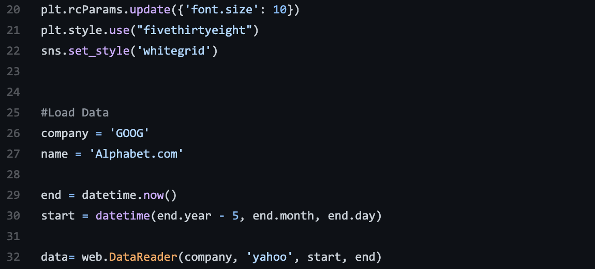

```{r setup, include=FALSE}
knitr::opts_chunk$set(echo = FALSE)
```
## LSTM Modeling

Long Short-Term Memory or LSTM is type of RNN (Recurrent neural network), that handles long-term dependencies. RNN are like memory loops, they keep repeating over and over to give a new point. The problem with them is the more you repeat the loop the more unstable the points of data will be and will create long-term dependency problems. That is where LSTM comes into play. LSTM is designed to avoid the long-term dependency problem because unlike RNN the loops or chains, LSTM doesn’t have one single neural network layer (like RNNs), but four. In the illustration below we will review over why this makes such a difference. 

```{r, echo = FALSE, fig.align = 'center', out.width ='80%'}
knitr::include_graphics("LSTM-1.png")
```  

```{r, echo = FALSE, fig.align = 'center', out.width ='80%'}
knitr::include_graphics("LSTM-L.png")
```   
Image source: https://towardsdatascience.com/illustrated-guide-to-lstms-and-gru-s-a-step-by-step-explanation-44e9eb85bf21 

The each of the four gates shown above learn which data in a sequence is important and decides with data points are necessary to keep or throw away. It passes the necessary information down the sequences to make the predictions. Therefore, condensing data and removing the outliers that would overpopulate and cause issues in the predictions.  

### How to setup LSTM? 

#### 1.Import libraries 
#### 2.Pull and process data 
#### 3.Create LSTM Model 
#### 4.Train the data 
#### 5.Predictions 

### 1. Import libraries 
```{r, echo = FALSE, fig.align = 'center', out.width ='100%'}
knitr::include_graphics("LSTM-2.png")
```  

### 2. Pull and process data 
```{r, echo = FALSE, fig.align = 'center', out.width ='100%'}

```  


Normalize data; I set my prediction days to 60 days to understand how stock prices will look 	over the course of them next 2 months.  

 
### 2b. Prepare the data
```{r, echo = FALSE, fig.align = 'center', out.width ='100%'}
knitr::include_graphics("LSTM-4.png")
```  

### 3. Build the LSTM Model
```{r, echo = FALSE, fig.align = 'center', out.width ='100%'}
knitr::include_graphics("LSTM-5.png")
```  

### 4. Train the data
```{r, echo = FALSE, fig.align = 'center', out.width ='100%'}
knitr::include_graphics("LSTM-6.png")
```  

### 5. Predictions

```{r, echo = FALSE, fig.align = 'center', out.width ='100%'}
knitr::include_graphics("LSTM-7.png")
```  

```{r, echo = FALSE, fig.align = 'center', out.width ='100%'}
knitr::include_graphics("LSTM-8.png")
```  

```{r, echo = FALSE, fig.align = 'center', out.width ='100%'}

```  

```{r, echo = FALSE, fig.align = 'center', out.width ='100%'}

```  


